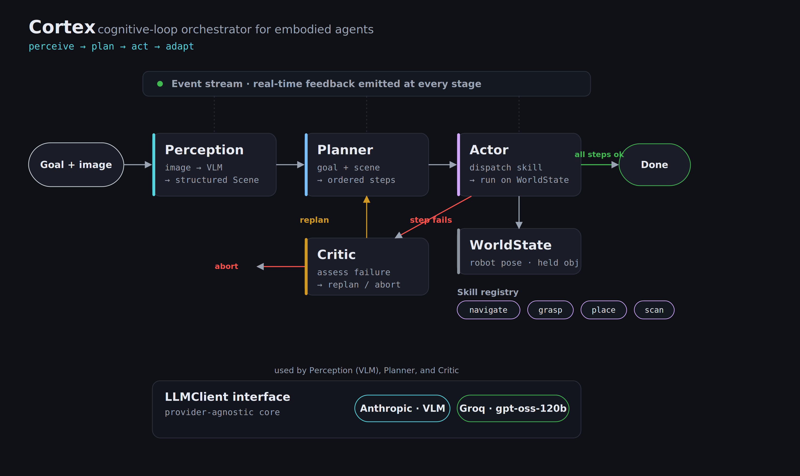
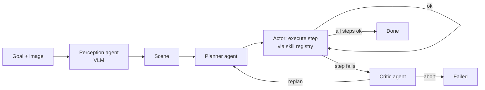
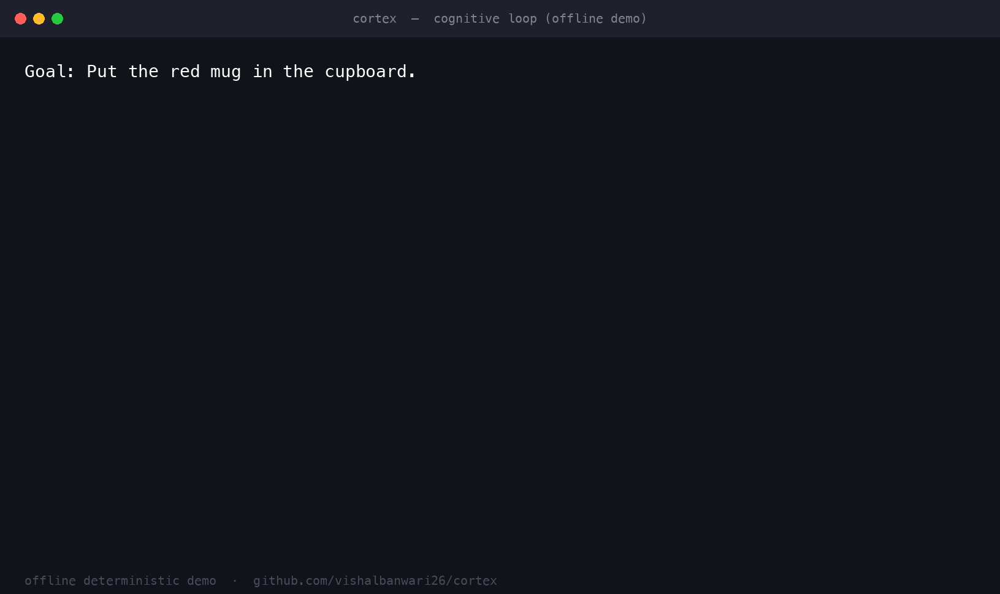

# Cortex

A cognitive-loop orchestrator for embodied agents. It takes a natural-language
goal and a scene, perceives the scene with a vision-language model, plans a
multi-step task, dispatches each step to modular sub-agents and skills, and
adapts in real time when a step fails. Every stage streams as an event, so the
agent's reasoning and action are observable as they happen.

The orchestration layer is provider-agnostic: it depends on an `LLMClient`
interface, not a vendor SDK, so the same loop runs against a hosted model in the
cloud or a smaller model at the edge.



## The task

A concrete run: the goal is "put the red mug in the cupboard." The agent
perceives the mug on the table, plans to pick it up and store it, and on the
first failed grasp it replans to navigate first. Before and after:

<p align="center">
  
  
</p>

The skills are simulated, so these illustrate the start and goal states the loop
reasons over rather than rendered robot output.

## The cognitive loop



- **Perception agent** turns a multimodal input into a structured `Scene`.
- **Planner agent** decomposes the goal into an ordered plan bound to available skills.
- **Actor** executes each step against a mutable `WorldState` through the skill registry.
- **Critic agent** inspects failures and decides whether to replan or abort.
- **Orchestrator** sequences all of it and emits real-time events. It is small on
  purpose: the intelligence lives in the agents, the loop just coordinates them.

## Run it

No API key needed for the offline demo (it uses a deterministic mock model):

```bash
pip install -e .
python -m cortex.cli "Put the red mug in the cupboard."
```

Sample output:

```
 [plan] 1. grasp red mug | 2. place cupboard
   [>>] [grasp] grasp -> red mug
  [err] 'red mug' is at table but the robot is at dock; out of reach.
    [!] Grasp failed because the robot was not at the object's location.
    [~] Replanning (attempt 1)...
 [plan] 1. navigate table | 2. grasp red mug | 3. place cupboard
   ...
 [done] Goal achieved.
```

The first plan is deliberately incomplete. The grasp fails, the critic catches
why, and the replanned plan navigates first and succeeds. That is the adaptive
loop, not a happy path.



### With a real VLM

```bash
pip install -e ".[live]"
export ANTHROPIC_API_KEY=sk-ant-...
python -m cortex.cli "Tidy the table." --live --image examples/scene.jpg
```

The perception agent then reads the actual image and the planner reasons over
what it sees.

## Tests

```bash
pip install -e ".[dev]"
pytest -q
```

The suite runs entirely on the mock client, so it is fast and deterministic. The
headline test asserts the recovery path: plan fails, critic replans, goal is met.

## Design notes

- **Provider-agnostic core.** Agents call `LLMClient.complete(...)`, never an SDK.
  Cloud and edge are concrete clients behind the same interface.
- **Skills as a registry.** Capabilities (`navigate`, `grasp`, `place`, `scan`)
  register themselves and are discovered by name. New skills plug in without
  touching the orchestrator or planner.
- **State with consequences.** Skills read and mutate a `WorldState`, so later
  steps reason over the results of earlier ones, and failures are real
  (`grasp` only works when the robot is co-located with the target).
- **Bounded adaptation.** The replan loop is capped (`max_replans`) so a
  pathological scene cannot spin forever.

## What this is, and what it is not

This is a sandbox. The skills are simulated, not connected to a real robot. The
point is the orchestration architecture: the perception-to-planning-to-action
loop, the modular sub-agent interface, real-time feedback, and failure-driven
replanning. Swapping the simulated skills for a robot SDK or a ROS bridge would
not change the orchestrator or the agents, which is the property worth showing.

## License

MIT